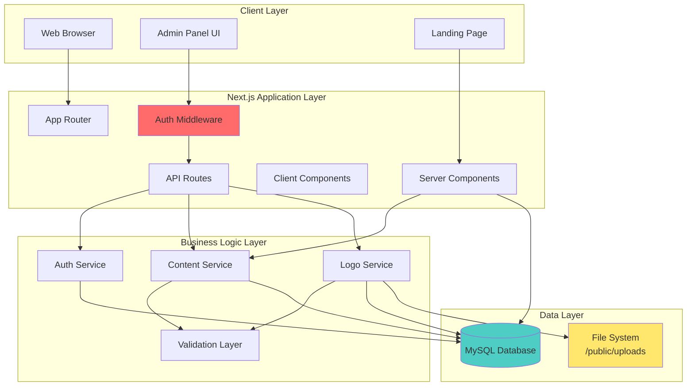
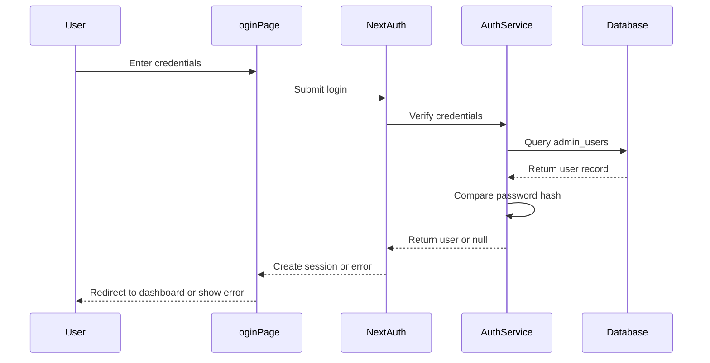
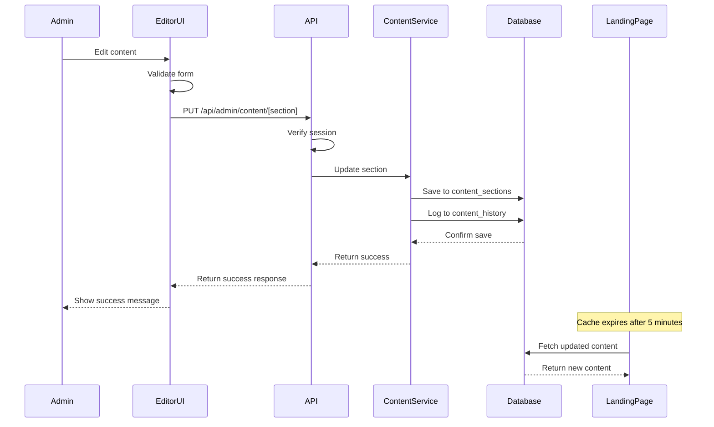
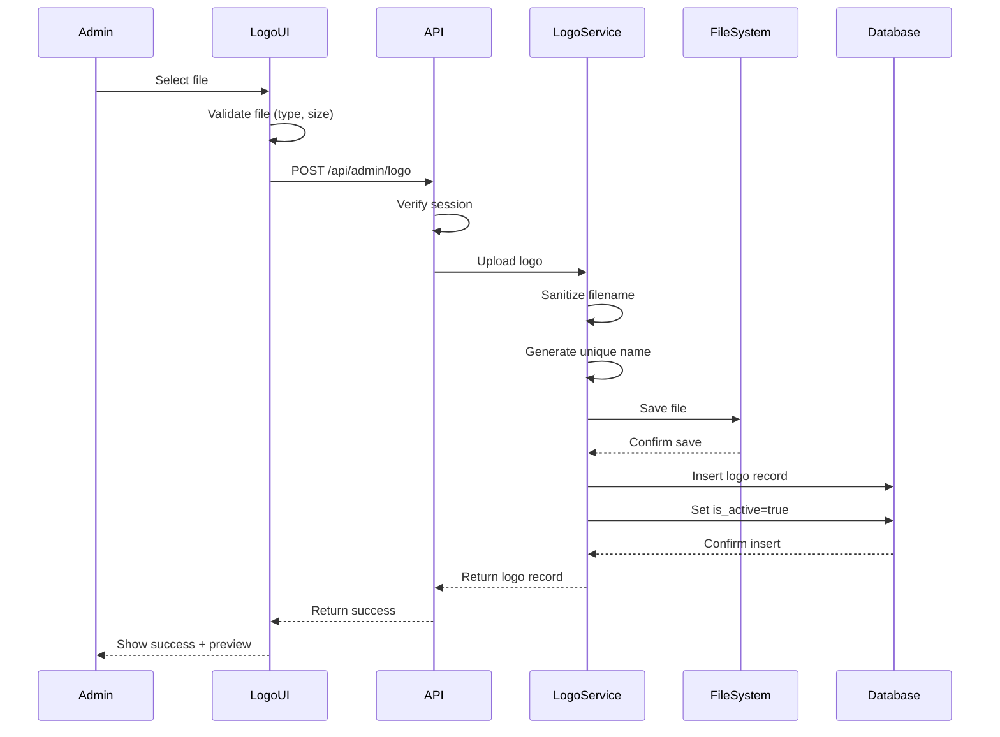

# Design Document: Ice Star Administrative Panel

## Overview

This design document specifies the technical architecture for implementing an administrative panel for the Ice Star landing page. The system enables authorized administrators to authenticate, manage site content, and upload visual assets through a protected web interface built with Next.js 16 App Router, TypeScript, and MySQL.

### Design Goals

1. **Security-First Architecture**: Implement robust authentication and authorization protecting administrative functions
2. **Database-Driven Content**: Migrate hardcoded content to MySQL database for dynamic management
3. **Seamless Integration**: Maintain compatibility with existing landing page components and styling
4. **Developer Experience**: Leverage Next.js 16 App Router features for optimal performance and maintainability
5. **Extensibility**: Design schema and architecture to support future enhancements

### Key Design Decisions

- **Authentication Strategy**: NextAuth.js v5 (Auth.js) for production-ready authentication with session management
- **Content Storage**: Hybrid approach using normalized tables for structured data (services, applications) and flexible JSON storage for simple content sections
- **File Upload**: Filesystem-based storage in `/public/uploads/logos/` with database metadata tracking
- **API Layer**: Next.js API Routes (App Router) for RESTful content management endpoints
- **Frontend Architecture**: Server Components for public pages, Client Components for admin interfaces
- **Database Access**: Direct MySQL connection using `mysql2` library with connection pooling

## Architecture

### System Architecture Diagram



### Route Structure

```
/                           # Public landing page (existing)
/admin                      # Admin panel (protected)
  /login                    # Login page (public)
  /dashboard                # Admin dashboard (protected)
  /content                  # Content management (protected)
    /hero                   # Hero section editor
    /about                  # About section editor
    /services               # Services editor
    /applications           # Applications editor
    /differentials          # Differentials editor
    /cta                    # CTA section editor
    /contact-form           # Contact form content editor
    /footer                 # Footer editor
  /logo                     # Logo management (protected)
  /settings                 # Admin settings (protected)
/api                        # API routes
  /auth                     # Authentication endpoints
    /[...nextauth]          # NextAuth.js dynamic route
  /admin                    # Admin API endpoints (protected)
    /content                # Content CRUD operations
      /[section]            # Dynamic section endpoint
    /logo                   # Logo upload/management
    /dashboard              # Dashboard data
```

### Technology Stack

**Frontend:**
- Next.js 16 (App Router)
- React 19
- TypeScript 6
- Tailwind CSS 3.4
- React Hook Form 7.72 + Zod 4.3 (validation)
- Lucide React 1.8 (icons)

**Backend:**
- Next.js API Routes (App Router)
- NextAuth.js v5 (Auth.js)
- mysql2 (database driver)
- bcrypt (password hashing)

**Database:**
- MySQL 8.0

**File Storage:**
- Local filesystem (`/public/uploads/logos/`)

**Development:**
- Docker Compose (MySQL + phpMyAdmin)
- ESLint + TypeScript

## Components and Interfaces

### Authentication Components

#### 1. Login Page Component
**Location:** `src/app/admin/login/page.tsx`

```typescript
interface LoginPageProps {}

interface LoginFormData {
  email: string;
  password: string;
}
```

**Responsibilities:**
- Render login form with email and password inputs
- Handle form validation using React Hook Form + Zod
- Submit credentials to NextAuth.js
- Display authentication errors
- Redirect to dashboard on successful login

#### 2. Auth Middleware
**Location:** `src/middleware.ts`

```typescript
export function middleware(request: NextRequest): NextResponse
```

**Responsibilities:**
- Intercept requests to protected routes (`/admin/*` except `/admin/login`)
- Verify session validity using NextAuth.js
- Redirect unauthenticated users to `/admin/login`
- Allow authenticated users to proceed

#### 3. Auth Service
**Location:** `src/lib/services/auth.service.ts`

```typescript
interface AuthService {
  verifyCredentials(email: string, password: string): Promise<AdminUser | null>;
  hashPassword(password: string): Promise<string>;
  comparePassword(password: string, hash: string): Promise<boolean>;
  createInitialAdmin(): Promise<{ email: string; password: string }>;
}

interface AdminUser {
  id: number;
  email: string;
  password_hash: string;
  created_at: Date;
  updated_at: Date;
}
```

**Responsibilities:**
- Verify user credentials against database
- Hash passwords using bcrypt (10 rounds)
- Compare plaintext passwords with hashes
- Create initial admin user with random password

### Content Management Components

#### 4. Content Service
**Location:** `src/lib/services/content.service.ts`

```typescript
interface ContentService {
  getSection(sectionKey: string): Promise<ContentSection | null>;
  getAllSections(): Promise<ContentSection[]>;
  updateSection(sectionKey: string, data: Record<string, any>): Promise<void>;
  getSectionHistory(sectionKey: string, limit?: number): Promise<ContentHistory[]>;
}

interface ContentSection {
  section_key: string;
  data: Record<string, any>; // JSON object with section fields
  updated_at: Date;
  updated_by: string;
}

interface ContentHistory {
  id: number;
  section_key: string;
  field_key: string;
  old_value: string;
  new_value: string;
  changed_by: string;
  changed_at: Date;
}
```

**Responsibilities:**
- Retrieve content sections from database
- Update content sections with validation
- Track content change history
- Provide fallback values for missing content

#### 5. Content Editor Components
**Location:** `src/app/admin/content/[section]/page.tsx`

```typescript
interface ContentEditorProps {
  params: { section: string };
}

interface HeroContentData {
  main_title: string;
  subtitle: string;
  description: string;
  primary_button_text: string;
  secondary_button_text: string;
}

interface AboutContentData {
  section_title: string;
  main_description: string;
  benefits: Array<{
    id: string;
    title: string;
    description: string;
    icon: string;
  }>;
}

// Similar interfaces for other sections...
```

**Responsibilities:**
- Render section-specific edit forms
- Load current content from API
- Validate form inputs
- Submit updates to API
- Display success/error messages
- Preview changes

#### 6. Dashboard Component
**Location:** `src/app/admin/dashboard/page.tsx`

```typescript
interface DashboardProps {}

interface DashboardData {
  sections: Array<{
    key: string;
    label: string;
    last_updated: Date;
    updated_by: string;
  }>;
  logo: {
    file_name: string;
    uploaded_at: Date;
  } | null;
  contact_submissions_count: number;
  recent_changes: ContentHistory[];
}
```

**Responsibilities:**
- Display overview of all content sections
- Show last updated timestamps
- Display current logo information
- Show contact form submission count
- List recent content changes
- Provide quick links to editors

### Logo Management Components

#### 7. Logo Service
**Location:** `src/lib/services/logo.service.ts`

```typescript
interface LogoService {
  uploadLogo(file: File): Promise<LogoRecord>;
  getActiveLogo(): Promise<LogoRecord | null>;
  setActiveLogo(id: number): Promise<void>;
  deleteLogo(id: number): Promise<void>;
  getAllLogos(): Promise<LogoRecord[]>;
}

interface LogoRecord {
  id: number;
  file_name: string;
  file_path: string;
  file_size: number;
  mime_type: string;
  uploaded_at: Date;
  is_active: boolean;
}
```

**Responsibilities:**
- Handle file upload with validation
- Store files in filesystem
- Save metadata to database
- Manage active logo selection
- Delete logo files and records

#### 8. Logo Upload Component
**Location:** `src/app/admin/logo/page.tsx`

```typescript
interface LogoUploadProps {}

interface LogoUploadFormData {
  file: FileList;
}
```

**Responsibilities:**
- Render file upload interface
- Preview selected file before upload
- Validate file type and size
- Upload file to API
- Display current active logo
- Allow logo selection from uploaded files

### API Endpoints

#### 9. Authentication API
**Location:** `src/app/api/auth/[...nextauth]/route.ts`

```typescript
// NextAuth.js configuration
export const authOptions: NextAuthOptions = {
  providers: [
    CredentialsProvider({
      credentials: {
        email: { type: "email" },
        password: { type: "password" }
      },
      authorize: async (credentials) => {
        // Verify credentials using AuthService
      }
    })
  ],
  session: {
    strategy: "jwt",
    maxAge: 24 * 60 * 60 // 24 hours
  },
  pages: {
    signIn: "/admin/login"
  }
};
```

#### 10. Content API Endpoints
**Location:** `src/app/api/admin/content/[section]/route.ts`

```typescript
// GET /api/admin/content/[section]
export async function GET(
  request: NextRequest,
  { params }: { params: { section: string } }
): Promise<NextResponse<ContentSection | ErrorResponse>>

// PUT /api/admin/content/[section]
export async function PUT(
  request: NextRequest,
  { params }: { params: { section: string } }
): Promise<NextResponse<SuccessResponse | ErrorResponse>>

interface ErrorResponse {
  error: string;
  details?: string;
}

interface SuccessResponse {
  success: boolean;
  message: string;
  data?: any;
}
```

#### 11. Logo API Endpoints
**Location:** `src/app/api/admin/logo/route.ts`

```typescript
// POST /api/admin/logo
export async function POST(
  request: NextRequest
): Promise<NextResponse<LogoRecord | ErrorResponse>>

// GET /api/admin/logo
export async function GET(
  request: NextRequest
): Promise<NextResponse<LogoRecord | ErrorResponse>>
```

### Landing Page Integration Components

#### 12. Content Fetcher Utility
**Location:** `src/lib/utils/content-fetcher.ts`

```typescript
interface ContentFetcher {
  getHeroContent(): Promise<HeroContentData>;
  getAboutContent(): Promise<AboutContentData>;
  getCTAContent(): Promise<CTAContentData>;
  getContactFormContent(): Promise<ContactFormContentData>;
  getFooterContent(): Promise<FooterContentData>;
  getActiveLogo(): Promise<string | null>;
}
```

**Responsibilities:**
- Fetch content from database for landing page
- Implement caching (5-minute TTL)
- Provide fallback values
- Handle database errors gracefully

#### 13. Updated Landing Page Components
**Modifications to existing components:**

- `Hero.tsx`: Replace hardcoded text with dynamic content from `ContentFetcher`
- `About.tsx`: Replace hardcoded text with dynamic content
- `CTASection.tsx`: Already accepts props, fetch from database
- `ContactForm.tsx`: Replace hardcoded labels with dynamic content
- `Header.tsx`: Load logo from database or display fallback text
- `Footer.tsx`: Replace hardcoded contact info with dynamic content

## Data Models

### Database Schema

#### Table: admin_users
```sql
CREATE TABLE admin_users (
    id INT AUTO_INCREMENT PRIMARY KEY,
    email VARCHAR(255) UNIQUE NOT NULL,
    password_hash VARCHAR(255) NOT NULL,
    created_at TIMESTAMP DEFAULT CURRENT_TIMESTAMP,
    updated_at TIMESTAMP DEFAULT CURRENT_TIMESTAMP ON UPDATE CURRENT_TIMESTAMP,
    INDEX idx_email (email)
) ENGINE=InnoDB DEFAULT CHARSET=utf8mb4 COLLATE=utf8mb4_unicode_ci;
```

**Purpose:** Store administrator user accounts

**Fields:**
- `id`: Primary key
- `email`: Unique email address for login
- `password_hash`: Bcrypt hashed password
- `created_at`: Account creation timestamp
- `updated_at`: Last modification timestamp

#### Table: content_sections
```sql
CREATE TABLE content_sections (
    id INT AUTO_INCREMENT PRIMARY KEY,
    section_key VARCHAR(100) UNIQUE NOT NULL,
    section_data JSON NOT NULL,
    updated_at TIMESTAMP DEFAULT CURRENT_TIMESTAMP ON UPDATE CURRENT_TIMESTAMP,
    updated_by VARCHAR(255),
    INDEX idx_section_key (section_key)
) ENGINE=InnoDB DEFAULT CHARSET=utf8mb4 COLLATE=utf8mb4_unicode_ci;
```

**Purpose:** Store flexible content for simple sections (hero, about, cta, contact_form, footer)

**Fields:**
- `id`: Primary key
- `section_key`: Unique identifier (e.g., 'hero', 'about', 'cta')
- `section_data`: JSON object containing all section fields
- `updated_at`: Last modification timestamp
- `updated_by`: Email of admin who made the change

**Example JSON structure for hero section:**
```json
{
  "main_title": "Soluções Completas em Isolamento Térmico e Refrigeração Veicular",
  "subtitle": "Transforme seu veículo em uma câmara frigorífica profissional",
  "description": "A Ice Star é especialista em adaptação de veículos...",
  "primary_button_text": "Solicite um Orçamento",
  "secondary_button_text": "Conheça Nossos Serviços"
}
```

#### Table: logos
```sql
CREATE TABLE logos (
    id INT AUTO_INCREMENT PRIMARY KEY,
    file_name VARCHAR(255) NOT NULL,
    file_path VARCHAR(500) NOT NULL,
    file_size INT NOT NULL,
    mime_type VARCHAR(100) NOT NULL,
    uploaded_at TIMESTAMP DEFAULT CURRENT_TIMESTAMP,
    is_active BOOLEAN DEFAULT FALSE,
    INDEX idx_is_active (is_active)
) ENGINE=InnoDB DEFAULT CHARSET=utf8mb4 COLLATE=utf8mb4_unicode_ci;
```

**Purpose:** Track uploaded logo files and active logo

**Fields:**
- `id`: Primary key
- `file_name`: Original or sanitized filename
- `file_path`: Relative path from public directory (e.g., '/uploads/logos/logo-123456.png')
- `file_size`: File size in bytes
- `mime_type`: MIME type (image/png, image/jpeg, etc.)
- `uploaded_at`: Upload timestamp
- `is_active`: Boolean flag indicating the currently active logo (only one should be true)

#### Table: content_history
```sql
CREATE TABLE content_history (
    id INT AUTO_INCREMENT PRIMARY KEY,
    section_key VARCHAR(100) NOT NULL,
    field_key VARCHAR(100) NOT NULL,
    old_value TEXT,
    new_value TEXT,
    changed_by VARCHAR(255) NOT NULL,
    changed_at TIMESTAMP DEFAULT CURRENT_TIMESTAMP,
    INDEX idx_section_key (section_key),
    INDEX idx_changed_at (changed_at)
) ENGINE=InnoDB DEFAULT CHARSET=utf8mb4 COLLATE=utf8mb4_unicode_ci;
```

**Purpose:** Track content change history for audit and recovery

**Fields:**
- `id`: Primary key
- `section_key`: Section identifier
- `field_key`: Specific field that changed
- `old_value`: Previous value
- `new_value`: New value
- `changed_by`: Email of admin who made the change
- `changed_at`: Change timestamp

#### Existing Tables (Preserved)

The following tables already exist and will continue to be used:

- `services`: Stores service offerings (already populated)
- `vehicle_applications`: Stores vehicle types (already populated)
- `differentials`: Stores competitive advantages (already populated)
- `site_settings`: Stores general site configuration
- `contact_submissions`: Stores contact form submissions

### Data Flow Diagrams

#### Authentication Flow


#### Content Update Flow


#### Logo Upload Flow



## Error Handling

### Error Handling Strategy

The system implements a layered error handling approach with specific strategies for each layer:

#### 1. Validation Layer Errors

**Client-Side Validation:**
- Use Zod schemas for form validation
- Display inline error messages below form fields
- Prevent form submission until validation passes
- Provide clear, actionable error messages in Portuguese

**Server-Side Validation:**
- Re-validate all inputs on the server
- Return 400 Bad Request with detailed error messages
- Validate file types, sizes, and content
- Sanitize all user inputs

**Example Error Response:**
```typescript
{
  "error": "Validation failed",
  "details": {
    "email": "Email inválido",
    "password": "Senha deve ter no mínimo 8 caracteres"
  }
}
```

#### 2. Authentication Errors

**Login Failures:**
- Return generic "Credenciais inválidas" message (security best practice)
- Log failed attempts for security monitoring
- Implement rate limiting (max 5 attempts per 15 minutes)
- Return 401 Unauthorized status

**Session Errors:**
- Redirect to login page when session expires
- Clear invalid session data
- Display "Sessão expirada, faça login novamente" message
- Return 401 Unauthorized status

**Authorization Errors:**
- Return 403 Forbidden for authenticated but unauthorized requests
- Log unauthorized access attempts
- Display "Acesso negado" message

#### 3. Database Errors

**Connection Errors:**
- Implement connection pooling with retry logic
- Log database connection failures
- Display user-friendly "Erro ao conectar ao banco de dados" message
- Return 503 Service Unavailable status
- Provide fallback content on landing page

**Query Errors:**
- Wrap all database operations in try-catch blocks
- Log SQL errors with context (query, parameters)
- Display "Erro ao processar solicitação" message
- Return 500 Internal Server Error status
- Rollback transactions on error

**Data Integrity Errors:**
- Validate foreign key constraints
- Handle unique constraint violations gracefully
- Display specific messages (e.g., "Email já cadastrado")
- Return 409 Conflict status

#### 4. File Upload Errors

**Validation Errors:**
- File too large: "Arquivo muito grande (máximo 5MB)"
- Invalid type: "Tipo de arquivo inválido (apenas PNG, JPG, JPEG, SVG, WEBP)"
- Return 400 Bad Request status

**Storage Errors:**
- Disk space issues: Log error, display "Erro ao salvar arquivo"
- Permission errors: Log error, display "Erro ao salvar arquivo"
- Return 500 Internal Server Error status
- Clean up partial uploads

**Security Errors:**
- Malicious file detected: Log security event, reject upload
- Display "Arquivo rejeitado por motivos de segurança"
- Return 400 Bad Request status

#### 5. API Errors

**Standard Error Response Format:**
```typescript
interface ErrorResponse {
  error: string;           // User-friendly message in Portuguese
  code?: string;           // Machine-readable error code
  details?: any;           // Additional error details
  timestamp: string;       // ISO 8601 timestamp
}
```

**HTTP Status Codes:**
- 200: Success
- 400: Bad Request (validation errors)
- 401: Unauthorized (authentication required)
- 403: Forbidden (insufficient permissions)
- 404: Not Found (resource doesn't exist)
- 409: Conflict (duplicate resource)
- 500: Internal Server Error (unexpected errors)
- 503: Service Unavailable (database/service down)

#### 6. Landing Page Errors

**Content Loading Errors:**
- Use fallback content when database is unavailable
- Log errors for monitoring
- Display page with default content
- Show subtle notice to admin users: "Usando conteúdo padrão"

**Logo Loading Errors:**
- Display "Ice Star" text when logo unavailable
- Log missing logo errors
- Continue page rendering

**Graceful Degradation:**
- Each section loads independently
- Failure in one section doesn't break entire page
- Use React Error Boundaries for component-level error handling

#### 7. Logging Strategy

**Log Levels:**
- ERROR: Authentication failures, database errors, file upload failures
- WARN: Validation failures, missing content, cache misses
- INFO: Successful logins, content updates, logo uploads
- DEBUG: Detailed request/response data (development only)

**Log Format:**
```typescript
{
  level: "ERROR" | "WARN" | "INFO" | "DEBUG",
  timestamp: string,
  message: string,
  context: {
    user?: string,
    action?: string,
    resource?: string,
    error?: Error
  }
}
```

**Log Storage:**
- Development: Console output
- Production: File-based logging or external service (future)

## Testing Strategy

### Testing Approach

This feature is **NOT suitable for property-based testing** because it primarily involves:
- Infrastructure as Code (database schema, API routes)
- Authentication and session management (external service behavior)
- File upload and storage (I/O operations)
- UI rendering and forms (visual components)
- Database CRUD operations (integration concerns)

Instead, we will use a comprehensive testing strategy combining:

1. **Unit Tests**: Test individual functions and utilities
2. **Integration Tests**: Test API endpoints and database operations
3. **Component Tests**: Test React components in isolation
4. **End-to-End Tests**: Test complete user workflows (future)

### Unit Testing

**Target:** Pure functions and utility modules

**Test Files:**
- `src/lib/utils/password.test.ts`: Password hashing and comparison
- `src/lib/utils/file-validation.test.ts`: File type and size validation
- `src/lib/utils/sanitization.test.ts`: Filename sanitization
- `src/lib/validations/content.test.ts`: Content validation schemas

**Example Test Cases:**
```typescript
describe('Password Utilities', () => {
  it('should hash password with bcrypt', async () => {
    const password = 'SecurePass123!';
    const hash = await hashPassword(password);
    expect(hash).toMatch(/^\$2[aby]\$\d{2}\$/);
  });

  it('should verify correct password', async () => {
    const password = 'SecurePass123!';
    const hash = await hashPassword(password);
    const isValid = await comparePassword(password, hash);
    expect(isValid).toBe(true);
  });

  it('should reject incorrect password', async () => {
    const password = 'SecurePass123!';
    const hash = await hashPassword(password);
    const isValid = await comparePassword('WrongPassword', hash);
    expect(isValid).toBe(false);
  });
});

describe('File Validation', () => {
  it('should accept valid image types', () => {
    expect(isValidImageType('image/png')).toBe(true);
    expect(isValidImageType('image/jpeg')).toBe(true);
    expect(isValidImageType('image/svg+xml')).toBe(true);
  });

  it('should reject invalid types', () => {
    expect(isValidImageType('application/pdf')).toBe(false);
    expect(isValidImageType('text/html')).toBe(false);
  });

  it('should reject files over 5MB', () => {
    expect(isValidFileSize(5 * 1024 * 1024)).toBe(true);
    expect(isValidFileSize(5 * 1024 * 1024 + 1)).toBe(false);
  });
});
```

**Testing Framework:** Jest or Vitest (to be determined based on Next.js 16 compatibility)

### Integration Testing

**Target:** API endpoints and database operations

**Test Files:**
- `src/app/api/admin/content/[section]/route.test.ts`: Content API endpoints
- `src/app/api/admin/logo/route.test.ts`: Logo API endpoints
- `src/lib/services/content.service.test.ts`: Content service with database
- `src/lib/services/logo.service.test.ts`: Logo service with filesystem

**Test Setup:**
- Use test database instance
- Seed test data before each test suite
- Clean up test data after each test
- Mock filesystem operations where appropriate

**Example Test Cases:**
```typescript
describe('Content API - GET /api/admin/content/[section]', () => {
  it('should return 401 without authentication', async () => {
    const response = await fetch('/api/admin/content/hero');
    expect(response.status).toBe(401);
  });

  it('should return section content when authenticated', async () => {
    const session = await createTestSession();
    const response = await fetch('/api/admin/content/hero', {
      headers: { Cookie: session.cookie }
    });
    expect(response.status).toBe(200);
    const data = await response.json();
    expect(data).toHaveProperty('section_key', 'hero');
    expect(data).toHaveProperty('section_data');
  });

  it('should return 404 for non-existent section', async () => {
    const session = await createTestSession();
    const response = await fetch('/api/admin/content/invalid', {
      headers: { Cookie: session.cookie }
    });
    expect(response.status).toBe(404);
  });
});

describe('Content API - PUT /api/admin/content/[section]', () => {
  it('should update section content', async () => {
    const session = await createTestSession();
    const newContent = {
      main_title: 'Updated Title',
      subtitle: 'Updated Subtitle'
    };
    const response = await fetch('/api/admin/content/hero', {
      method: 'PUT',
      headers: {
        'Content-Type': 'application/json',
        Cookie: session.cookie
      },
      body: JSON.stringify(newContent)
    });
    expect(response.status).toBe(200);
    
    // Verify content was updated
    const getResponse = await fetch('/api/admin/content/hero', {
      headers: { Cookie: session.cookie }
    });
    const data = await getResponse.json();
    expect(data.section_data.main_title).toBe('Updated Title');
  });

  it('should validate required fields', async () => {
    const session = await createTestSession();
    const invalidContent = { main_title: '' }; // Empty required field
    const response = await fetch('/api/admin/content/hero', {
      method: 'PUT',
      headers: {
        'Content-Type': 'application/json',
        Cookie: session.cookie
      },
      body: JSON.stringify(invalidContent)
    });
    expect(response.status).toBe(400);
  });

  it('should record content history', async () => {
    const session = await createTestSession();
    const newContent = { main_title: 'New Title' };
    await fetch('/api/admin/content/hero', {
      method: 'PUT',
      headers: {
        'Content-Type': 'application/json',
        Cookie: session.cookie
      },
      body: JSON.stringify(newContent)
    });
    
    // Verify history was recorded
    const history = await getContentHistory('hero');
    expect(history.length).toBeGreaterThan(0);
    expect(history[0].new_value).toContain('New Title');
  });
});
```

### Component Testing

**Target:** React components (admin UI and updated landing page components)

**Test Files:**
- `src/app/admin/login/page.test.tsx`: Login page component
- `src/app/admin/dashboard/page.test.tsx`: Dashboard component
- `src/app/admin/content/[section]/page.test.tsx`: Content editor components
- `src/components/sections/Hero.test.tsx`: Updated Hero component (existing)
- `src/components/layout/Header.test.tsx`: Updated Header with dynamic logo

**Testing Library:** React Testing Library

**Example Test Cases:**
```typescript
describe('Login Page', () => {
  it('should render login form', () => {
    render(<LoginPage />);
    expect(screen.getByLabelText(/email/i)).toBeInTheDocument();
    expect(screen.getByLabelText(/senha/i)).toBeInTheDocument();
    expect(screen.getByRole('button', { name: /entrar/i })).toBeInTheDocument();
  });

  it('should show validation errors for empty fields', async () => {
    render(<LoginPage />);
    const submitButton = screen.getByRole('button', { name: /entrar/i });
    fireEvent.click(submitButton);
    
    await waitFor(() => {
      expect(screen.getByText(/email é obrigatório/i)).toBeInTheDocument();
      expect(screen.getByText(/senha é obrigatória/i)).toBeInTheDocument();
    });
  });

  it('should submit form with valid credentials', async () => {
    const mockSignIn = jest.fn();
    render(<LoginPage />);
    
    fireEvent.change(screen.getByLabelText(/email/i), {
      target: { value: 'admin@icestar.com' }
    });
    fireEvent.change(screen.getByLabelText(/senha/i), {
      target: { value: 'SecurePass123!' }
    });
    fireEvent.click(screen.getByRole('button', { name: /entrar/i }));
    
    await waitFor(() => {
      expect(mockSignIn).toHaveBeenCalledWith({
        email: 'admin@icestar.com',
        password: 'SecurePass123!'
      });
    });
  });
});

describe('Hero Component with Dynamic Content', () => {
  it('should render content from props', () => {
    const content = {
      main_title: 'Test Title',
      subtitle: 'Test Subtitle',
      description: 'Test Description',
      primary_button_text: 'Primary Button',
      secondary_button_text: 'Secondary Button'
    };
    render(<Hero content={content} />);
    
    expect(screen.getByText('Test Title')).toBeInTheDocument();
    expect(screen.getByText('Test Subtitle')).toBeInTheDocument();
    expect(screen.getByText('Test Description')).toBeInTheDocument();
  });

  it('should render fallback content when props missing', () => {
    render(<Hero content={null} />);
    expect(screen.getByText(/conteúdo não disponível/i)).toBeInTheDocument();
  });
});
```

### Manual Testing Checklist

**Authentication Flow:**
- [ ] Login with valid credentials succeeds
- [ ] Login with invalid credentials fails with appropriate message
- [ ] Session persists across page refreshes
- [ ] Session expires after 24 hours
- [ ] Logout clears session
- [ ] Protected routes redirect to login when unauthenticated
- [ ] Authenticated users can access admin panel

**Content Management:**
- [ ] Dashboard displays all sections with last updated timestamps
- [ ] Each content editor loads current content
- [ ] Form validation prevents empty required fields
- [ ] Content updates save successfully
- [ ] Success message displays after save
- [ ] Changes appear on landing page after cache expiry
- [ ] Content history records changes
- [ ] Multiple admins can edit without conflicts

**Logo Management:**
- [ ] Logo upload accepts valid image types (PNG, JPG, JPEG, SVG, WEBP)
- [ ] Logo upload rejects invalid types
- [ ] Logo upload rejects files over 5MB
- [ ] Uploaded logo displays in admin panel
- [ ] Uploaded logo displays on landing page header
- [ ] Fallback text displays when no logo exists
- [ ] Old logo can be replaced with new logo

**Landing Page Integration:**
- [ ] All sections load with database content
- [ ] Fallback content displays when database unavailable
- [ ] Logo loads from database
- [ ] Page renders correctly with all dynamic content
- [ ] No console errors
- [ ] Performance remains acceptable (< 2s load time)

**Security:**
- [ ] Passwords are hashed in database
- [ ] SQL injection attempts are prevented
- [ ] XSS attempts are sanitized
- [ ] File upload validates MIME types
- [ ] Malicious filenames are sanitized
- [ ] Session cookies are HTTP-only
- [ ] CSRF protection is active

**Error Handling:**
- [ ] Database connection errors display user-friendly messages
- [ ] Validation errors display inline
- [ ] File upload errors display appropriate messages
- [ ] 404 errors handled gracefully
- [ ] 500 errors logged and display generic message

### Test Coverage Goals

- **Unit Tests**: 80% coverage for utility functions
- **Integration Tests**: 100% coverage for API endpoints
- **Component Tests**: 70% coverage for UI components
- **Manual Tests**: 100% completion of checklist before deployment

### Continuous Integration

**Future CI/CD Pipeline:**
1. Run unit tests on every commit
2. Run integration tests on pull requests
3. Run component tests on pull requests
4. Deploy to staging after tests pass
5. Manual QA on staging
6. Deploy to production after approval

## Implementation Plan

### Phase 1: Database Setup (Priority: High)

**Tasks:**
1. Create database migration script for new tables
2. Create seed script for initial admin user
3. Create seed script for content migration
4. Test database setup with Docker Compose
5. Document database schema

**Deliverables:**
- `database/migrations/02-admin-panel-tables.sql`
- `database/seeds/01-initial-admin.sql`
- `database/seeds/02-migrate-content.sql`
- Updated database documentation

### Phase 2: Authentication System (Priority: High)

**Tasks:**
1. Install and configure NextAuth.js v5
2. Create auth service with password hashing
3. Create login page component
4. Implement auth middleware
5. Test authentication flow
6. Add session management

**Deliverables:**
- `src/app/api/auth/[...nextauth]/route.ts`
- `src/lib/services/auth.service.ts`
- `src/app/admin/login/page.tsx`
- `src/middleware.ts`
- Authentication tests

### Phase 3: Content Management Backend (Priority: High)

**Tasks:**
1. Create content service
2. Create content API endpoints
3. Implement content validation
4. Implement content history tracking
5. Test API endpoints
6. Add error handling

**Deliverables:**
- `src/lib/services/content.service.ts`
- `src/app/api/admin/content/[section]/route.ts`
- `src/lib/validations/content-schemas.ts`
- Integration tests

### Phase 4: Admin Panel UI (Priority: Medium)

**Tasks:**
1. Create admin layout component
2. Create dashboard page
3. Create content editor components for each section
4. Implement form validation
5. Add success/error messaging
6. Test UI components

**Deliverables:**
- `src/app/admin/layout.tsx`
- `src/app/admin/dashboard/page.tsx`
- `src/app/admin/content/[section]/page.tsx`
- Component tests

### Phase 5: Logo Management (Priority: Medium)

**Tasks:**
1. Create logo service
2. Create logo API endpoints
3. Create logo upload UI
4. Implement file validation
5. Test file upload flow
6. Add error handling

**Deliverables:**
- `src/lib/services/logo.service.ts`
- `src/app/api/admin/logo/route.ts`
- `src/app/admin/logo/page.tsx`
- Integration tests

### Phase 6: Landing Page Integration (Priority: High)

**Tasks:**
1. Create content fetcher utility
2. Update Hero component for dynamic content
3. Update About component for dynamic content
4. Update CTASection for dynamic content
5. Update ContactForm for dynamic content
6. Update Footer for dynamic content
7. Update Header for dynamic logo
8. Implement caching strategy
9. Add fallback content
10. Test landing page with dynamic content

**Deliverables:**
- `src/lib/utils/content-fetcher.ts`
- Updated section components
- Updated Header component
- Component tests

### Phase 7: Testing & Documentation (Priority: Medium)

**Tasks:**
1. Write unit tests
2. Write integration tests
3. Write component tests
4. Complete manual testing checklist
5. Document API endpoints
6. Document deployment process
7. Create admin user guide

**Deliverables:**
- Test files for all modules
- API documentation
- Deployment guide
- Admin user guide

### Phase 8: Deployment & Monitoring (Priority: Low)

**Tasks:**
1. Set up production database
2. Run migrations and seeds
3. Deploy application
4. Verify all functionality
5. Set up error logging
6. Monitor performance
7. Document admin credentials securely

**Deliverables:**
- Production deployment
- Monitoring dashboard
- Secure credential storage
- Deployment checklist

## Security Considerations

### Authentication Security

1. **Password Security:**
   - Use bcrypt with 10 rounds for hashing
   - Enforce minimum password length (8 characters)
   - Store only hashed passwords, never plaintext
   - Implement password complexity requirements (future)

2. **Session Security:**
   - Use HTTP-only cookies for session tokens
   - Set secure flag in production (HTTPS only)
   - Implement session expiration (24 hours)
   - Regenerate session ID after login
   - Clear session data on logout

3. **Rate Limiting:**
   - Limit login attempts (5 per 15 minutes per IP)
   - Implement exponential backoff for failed attempts
   - Log suspicious activity

### Input Validation & Sanitization

1. **Content Input:**
   - Validate all inputs with Zod schemas
   - Sanitize HTML content to prevent XSS
   - Limit field lengths
   - Validate data types

2. **File Upload:**
   - Validate MIME types (not just extensions)
   - Limit file size (5MB maximum)
   - Sanitize filenames (remove special characters, path traversal)
   - Generate unique filenames
   - Store files outside web root or in protected directory
   - Scan for malicious content (future)

3. **SQL Injection Prevention:**
   - Use parameterized queries exclusively
   - Never concatenate user input into SQL
   - Validate input types before queries
   - Use ORM or query builder (future consideration)

### Authorization

1. **Route Protection:**
   - Verify authentication on all admin routes
   - Check session validity before serving content
   - Redirect unauthenticated users to login
   - Implement role-based access control (future)

2. **API Protection:**
   - Verify authentication on all admin API endpoints
   - Validate request origin
   - Implement CSRF protection
   - Rate limit API requests

### Data Protection

1. **Sensitive Data:**
   - Never log passwords or session tokens
   - Mask sensitive data in error messages
   - Use environment variables for secrets
   - Encrypt database backups (future)

2. **Content History:**
   - Limit history retention (90 days)
   - Implement data retention policies
   - Allow admins to purge old history (future)

### Infrastructure Security

1. **Database:**
   - Use strong database passwords
   - Limit database user permissions
   - Enable SSL/TLS for database connections (production)
   - Regular security updates

2. **File System:**
   - Set appropriate file permissions
   - Limit write access to upload directory
   - Implement disk space monitoring
   - Regular backups

3. **Environment:**
   - Use environment variables for configuration
   - Never commit secrets to version control
   - Implement secrets management (future)
   - Regular dependency updates

### Monitoring & Logging

1. **Security Events:**
   - Log failed login attempts
   - Log unauthorized access attempts
   - Log file upload rejections
   - Log suspicious activity

2. **Audit Trail:**
   - Track all content changes
   - Record admin actions
   - Maintain change history
   - Implement log retention policy

## Performance Considerations

### Caching Strategy

1. **Content Caching:**
   - Cache content sections for 5 minutes
   - Implement cache invalidation on updates
   - Use in-memory cache (Node.js Map or Redis future)
   - Cache at service layer, not component layer

2. **Database Optimization:**
   - Use connection pooling
   - Add indexes on frequently queried fields
   - Optimize JSON queries
   - Monitor slow queries

3. **Static Assets:**
   - Serve uploaded logos through Next.js static file serving
   - Implement CDN for assets (future)
   - Use appropriate cache headers

### Database Performance

1. **Query Optimization:**
   - Use indexes on section_key, email, is_active
   - Limit history queries (default 100 records)
   - Use pagination for large result sets (future)
   - Monitor query performance

2. **Connection Management:**
   - Implement connection pooling (max 10 connections)
   - Set connection timeout (30 seconds)
   - Handle connection errors gracefully
   - Close connections properly

### File Upload Performance

1. **Upload Optimization:**
   - Stream file uploads (don't load entire file in memory)
   - Implement progress indicators
   - Set reasonable timeout (60 seconds)
   - Validate early (before full upload)

2. **Storage Optimization:**
   - Compress images (future)
   - Generate thumbnails (future)
   - Implement lazy loading
   - Monitor disk space

### Frontend Performance

1. **Component Optimization:**
   - Use Server Components where possible
   - Minimize Client Components
   - Implement code splitting
   - Lazy load admin panel components

2. **Bundle Optimization:**
   - Tree-shake unused dependencies
   - Minimize JavaScript bundle size
   - Use Next.js automatic optimization
   - Monitor bundle size

## Migration Strategy

### Content Migration Process

1. **Pre-Migration:**
   - Backup existing codebase
   - Document current content structure
   - Create migration script
   - Test migration on development database

2. **Migration Execution:**
   - Run database migrations (create tables)
   - Run seed script (create admin user)
   - Run content migration script (populate content_sections)
   - Verify data integrity
   - Test landing page with migrated content

3. **Post-Migration:**
   - Update components to use dynamic content
   - Test all landing page sections
   - Verify admin panel functionality
   - Monitor for errors
   - Keep hardcoded content as fallback initially

### Rollback Plan

1. **If Migration Fails:**
   - Restore database from backup
   - Revert code changes
   - Investigate failure cause
   - Fix issues and retry

2. **If Issues Found Post-Deployment:**
   - Landing page continues working with fallback content
   - Fix issues in admin panel
   - Re-run content migration if needed
   - No downtime for public site

### Deployment Checklist

- [ ] Backup production database
- [ ] Run database migrations
- [ ] Run seed scripts
- [ ] Note generated admin password
- [ ] Deploy application code
- [ ] Verify landing page loads
- [ ] Verify admin login works
- [ ] Test content editing
- [ ] Test logo upload
- [ ] Monitor error logs
- [ ] Document admin credentials securely
- [ ] Notify stakeholders of new admin panel

## Future Enhancements

The following features are prepared for but not implemented in this phase:

1. **Multiple Admin Users:**
   - User management interface
   - Role-based access control
   - Permission system
   - User activity tracking

2. **Advanced Content Features:**
   - Content versioning with restore capability
   - Content scheduling (publish dates)
   - Draft/published workflow
   - Content preview before publishing

3. **Media Management:**
   - Image gallery for multiple images
   - Image editing (crop, resize)
   - Video upload support
   - Asset library

4. **SEO Management:**
   - Meta tags editor
   - Open Graph tags
   - Sitemap generation
   - Robots.txt management

5. **Analytics Integration:**
   - Dashboard analytics
   - Content performance metrics
   - User behavior tracking
   - A/B testing support

6. **Multi-language Support:**
   - Content translation interface
   - Language switcher
   - Locale-specific content
   - RTL support

7. **API Enhancements:**
   - GraphQL API
   - Webhook support
   - External integrations
   - API documentation portal

8. **Performance Improvements:**
   - Redis caching
   - CDN integration
   - Image optimization pipeline
   - Database read replicas

9. **Security Enhancements:**
   - Two-factor authentication
   - IP whitelisting
   - Advanced rate limiting
   - Security audit logs

10. **DevOps:**
    - CI/CD pipeline
    - Automated testing
    - Staging environment
    - Blue-green deployment

## Conclusion

This design document provides a comprehensive technical specification for implementing the Ice Star administrative panel. The architecture leverages Next.js 16 App Router features, maintains compatibility with existing infrastructure, and provides a solid foundation for future enhancements.

Key design principles:
- **Security-first**: Robust authentication and input validation
- **Maintainability**: Clear separation of concerns and modular architecture
- **Performance**: Caching strategies and optimized database queries
- **Extensibility**: Flexible schema and architecture for future growth
- **User Experience**: Intuitive admin interface and graceful error handling

The implementation plan provides a phased approach to development, ensuring critical functionality is delivered first while maintaining system stability throughout the migration process.
