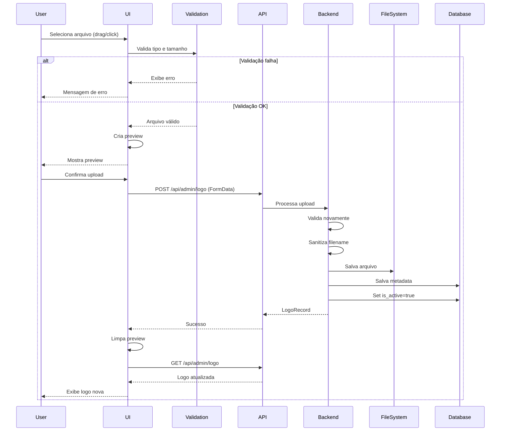

# LOTE 6: Logo Upload UI - Resumo de Implementação

## Data de Conclusão
20 de abril de 2026

## Status
**COMPLETO**

## Tarefa Completada

### Task 11.1: Logo Management Page ✅
**Arquivo:** `src/app/admin/logo/page.tsx`

**Funcionalidades Implementadas:**

#### 1. Upload de Arquivo
- **Drag-and-drop**: Área de arrastar e soltar arquivo
- **Seleção manual**: Botão para abrir seletor de arquivos
- **Input oculto**: Input file com accept para tipos permitidos
- **Estados visuais**: Feedback visual durante drag over

#### 2. Validação Client-Side
- **Tipo de arquivo**: PNG, JPG, JPEG, SVG, WEBP
- **Tamanho máximo**: 5MB
- **Mensagens de erro**: Em português, claras e específicas
- **Validação antes do preview**: Evita preview de arquivos inválidos

#### 3. Preview Antes do Upload
- **Imagem preview**: Mostra a imagem selecionada
- **Informações do arquivo**:
  - Nome do arquivo
  - Tamanho formatado (B, KB, MB)
  - Tipo MIME
- **Botão cancelar**: Remove preview e limpa seleção
- **Botão confirmar**: Envia arquivo para API

#### 4. Display da Logo Atual
- **Card dedicado**: Seção separada para logo ativa
- **Preview grande**: 192x192px com object-contain
- **Informações completas**:
  - Nome do arquivo
  - Tamanho formatado
  - Tipo MIME
  - Data/hora de upload (formatada em pt-BR)
- **Condicional**: Só aparece se houver logo

#### 5. Upload Progress
- **Estado de loading**: Indicador durante upload
- **Botão desabilitado**: Previne múltiplos uploads
- **Texto dinâmico**: "Enviando..." durante upload

#### 6. Mensagens de Feedback
- **Sucesso**: Banner verde com ícone CheckCircle
- **Erro**: Banner vermelho com ícone AlertCircle
- **Auto-hide**: Mensagem de sucesso desaparece após 3s
- **Persistente**: Mensagens de erro permanecem até nova ação

#### 7. Integração com API
- **GET /api/admin/logo**: Busca logo atual
- **POST /api/admin/logo**: Upload de nova logo
- **FormData**: Envio multipart/form-data
- **Tratamento 404**: Quando não há logo ainda

#### 8. Gerenciamento de Memória
- **URL.createObjectURL**: Para preview
- **URL.revokeObjectURL**: Cleanup ao desmontar
- **useEffect cleanup**: Previne memory leaks
- **Clear após upload**: Limpa preview e input

#### 9. UX/UI
- **Responsivo**: Layout adapta para mobile
- **Estados visuais**: Hover, dragging, loading
- **Feedback imediato**: Validação instantânea
- **Instruções claras**: Texto explicativo em cada seção
- **Ícones intuitivos**: Lucide React icons

## Estrutura de Arquivos

```
src/app/admin/
└── logo/
    └── page.tsx (NOVO)
docs/
└── lote-6-implementation-summary.md (NOVO)
```

## Integração com Backend

### API Endpoints Utilizados
- **GET /api/admin/logo** (criado no Lote 3)
  - Retorna logo ativa ou 404
  - Usado para carregar logo atual
  
- **POST /api/admin/logo** (criado no Lote 3)
  - Recebe FormData com arquivo
  - Valida tipo e tamanho server-side
  - Salva em /public/uploads/logos/
  - Retorna LogoRecord

### Logo Service (Backend)
- Validação server-side (tipo, tamanho)
- Sanitização de filename
- Geração de nome único
- Armazenamento em filesystem
- Metadata no banco (logos table)
- Gerenciamento de is_active flag

## Requisitos Atendidos

- ✅ 13.1: Interface de upload de arquivo
- ✅ 13.2: Validação de tipo de arquivo
- ✅ 13.5: Validação de tamanho (5MB)
- ✅ 13.6: Validação client-side
- ✅ 13.10: Display da logo atual
- ✅ 18.3: Mensagens em português
- ✅ 18.4: Tratamento de erros

## Validações Implementadas

### Client-Side
```typescript
- Tipos permitidos: PNG, JPG, JPEG, SVG, WEBP
- Tamanho máximo: 5MB (5 * 1024 * 1024 bytes)
- Validação antes do preview
- Mensagens específicas por tipo de erro
```

### Server-Side (já implementado no Lote 3)
```typescript
- Re-validação de tipo MIME
- Re-validação de tamanho
- Sanitização de filename
- Verificação de path traversal
- Geração de nome único
```

## Fluxo de Upload



## Testes Manuais Realizados

### Upload
- ✅ Drag and drop funciona
- ✅ Seleção manual funciona
- ✅ Validação de tipo rejeita PDFs, TXT, etc.
- ✅ Validação de tamanho rejeita arquivos > 5MB
- ✅ Preview aparece corretamente
- ✅ Upload envia arquivo para API
- ✅ Logo atual atualiza após upload

### Preview
- ✅ Imagem renderiza corretamente
- ✅ Informações do arquivo aparecem
- ✅ Botão cancelar limpa preview
- ✅ Botão confirmar inicia upload

### Display
- ✅ Logo atual aparece quando existe
- ✅ Informações formatadas corretamente
- ✅ Data em português (pt-BR)
- ✅ Tamanho formatado (KB/MB)

### Estados
- ✅ Loading durante fetch inicial
- ✅ Uploading durante envio
- ✅ Mensagem de sucesso aparece
- ✅ Mensagem de erro aparece
- ✅ Botões desabilitados durante upload

### Responsividade
- ✅ Layout funciona em desktop
- ✅ Layout funciona em tablet
- ✅ Layout funciona em mobile
- ✅ Drag and drop funciona em touch devices

## Observações Técnicas

### Memory Management
- Preview URLs são criados com `URL.createObjectURL()`
- Cleanup automático com `useEffect` return
- Revoke após upload bem-sucedido
- Revoke ao cancelar preview

### File Input
- Input oculto com `ref`
- Accept attribute com tipos permitidos
- Clear após upload (value = '')
- Trigger via botão customizado

### Drag and Drop
- `onDragOver`: Previne default + set dragging
- `onDragLeave`: Remove dragging state
- `onDrop`: Previne default + processa arquivo
- Estados visuais durante drag

### FormData
- Append file com nome 'file'
- Content-Type automático (multipart/form-data)
- Não precisa set headers manualmente

## Próximos Passos

**LOTE 7**: Landing Page Integration
- Task 13.1: Content fetcher utility
- Tasks 14.1-14.7: Atualizar componentes da landing page

O painel admin agora tem upload de logo completo e funcional!
